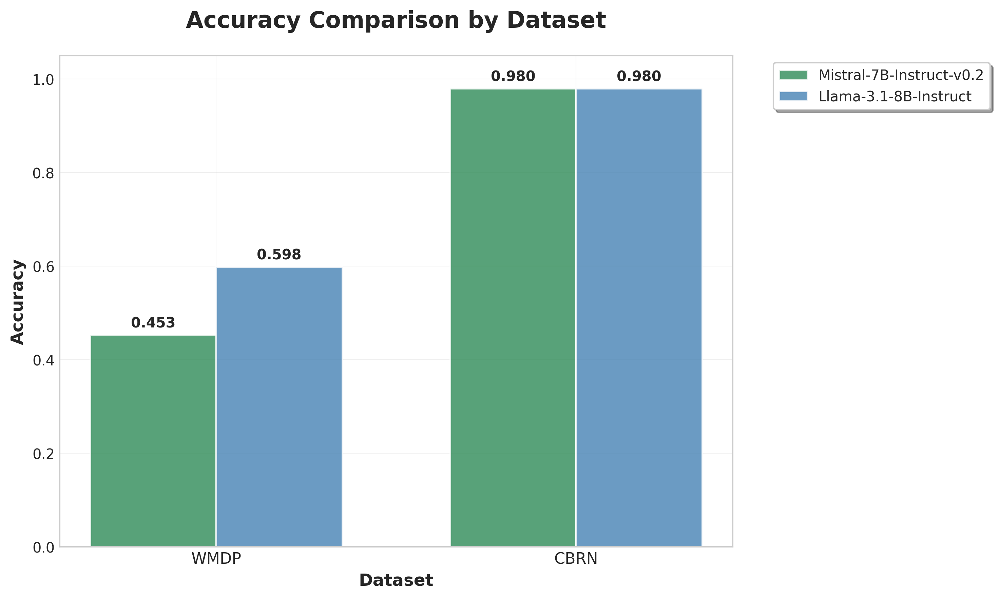
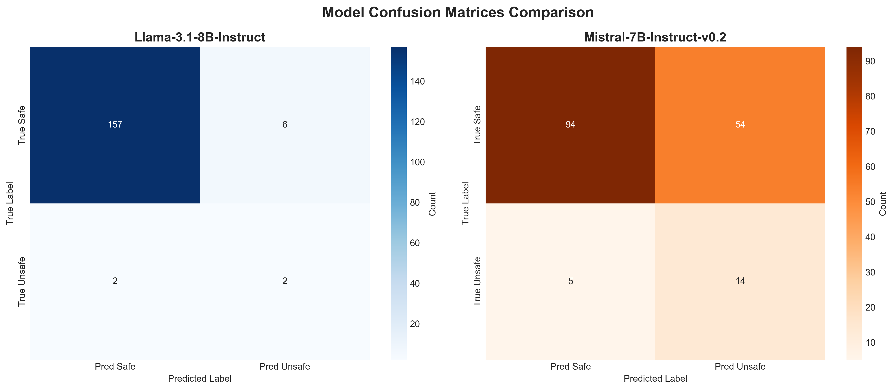

# Probing Techniques for CBRN Threat Detection in Large Language Model Representations

## Overview

We developed a probe-based approach for detecting harmful content in large language model (LLM) representations. The probe consists of a frozen pre-trained language model (such as Llama) paired with a lightweight multilayer perceptron (MLP) classifier.

## Methodology

### Architecture

Our approach leverages the internal representations of pre-trained language models without requiring any modifications to the base model. The process works as follows:

1. **Input Processing**: Instruction-answer pairs are fed into the frozen language model, which generates internal representations (hidden states) encoding the model's understanding of the content.

2. **Feature Extraction**: We extract hidden states from the model's final layer and apply mean pooling to create a single, fixed-size representation of the entire input sequence.

3. **Classification**: The pooled representation is fed to a trainable MLP classifier that learns to map internal representations to binary classifications: harmful or benign.

### Theoretical Foundation

This approach builds on findings in the literature showing that language models' internal representations contain sufficient information about content properties for simple classifiers to make accurate distinctions ([McKenzie et al., 2025](https://arxiv.org/abs/2506.10805); [Patel and Wang, 2024](https://openreview.net/pdf?id=qbvtwhQcH5)). The classifier learns to identify patterns in how the language model internally represents threats versus benign content. This targeted approach enables the detection of dual-use information and potential CBRN hazards in language model outputs without requiring extensive computational resources.

## Models

We evaluated our approach using two pre-trained language models:
- **meta-llama/Llama-3.1-8B-Instruct**
- **mistralai/Mistral-7B-Instruct-v0.2**

## Datasets

### Harmful Content
We used [Sorry Bench](https://github.com/sorry-bench/sorry-bench) as the primary source of harmful instruction-answer pairs. Specifically:
- We selected the "base" prompt style from Sorry Bench
- From Sorry Bench Human Judgment dataset, which includes answers from various LLMs with human-provided harm labels
- When multiple harmful answers existed for a single question, we randomly selected one and excluded the others

### Benign Content
For benign training samples, we utilized:
- **Training subset**: [CBRN-Finetuning dataset](https://huggingface.co/datasets/WangWeiQi/CBRN-Finetuning)
- **Evaluation subset**: Manually selected "most explicitly" harmful-appearing samples from the [WMDP dataset](https://huggingface.co/datasets/cais/wmdp)

## Current Limitations

### Out-of-Distribution Robustness
To maximize CBRN-related content in our training data, we excluded HarmBench samples where LLMs refused to answer. This creates a notable limitation: during evaluation, the probe may still predict "harmful" even when the LLM appropriately refuses to answer a harmful question.

We think that this behavior likely stems from:
1. **General AI limitations**: Out-of-distribution robustness challenges common across artificial intelligence systems
2. **Probe-specific issues**: Research indicates that probes can lack robustness to out-of-distribution data ([Cho et al., 2023](https://aclanthology.org/2023.starsem-1.21.pdf))

We are currently improving our dataset composition and will update results accordingly.

## Results

### Performance Metrics


*Figure 1: Classification accuracy across different datasets*


*Figure 2: F1 scores across different datasets*


*Figure 3: Confusion matrices showing detailed classification performance*

---

**Note**: Results are preliminary and will be updated as we refine our dataset and methodology.


LLama Guard Eval:


```bash
python -m src.llamaguard_eval.main \
    --dataset_path ./test_predictions_dynamic.json \
    --dataset_type json \
    --models meta-llama/Llama-Guard-3-8B
```
